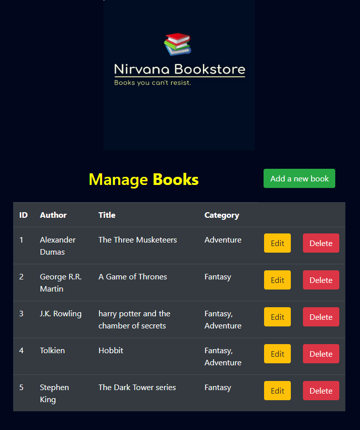

# Simple CRUD application using Flask Freamwork
I have used flask built-in sqlalchemy as a databese freamwork.
The database i used was postgres, which i run locally.

## Screenshots

## Heroku
The app is also deployed to heroku, so if you want you can give it a try.
[https://bookstore-crud.herokuapp.com](https://bookstore-crud.herokuapp.com)
